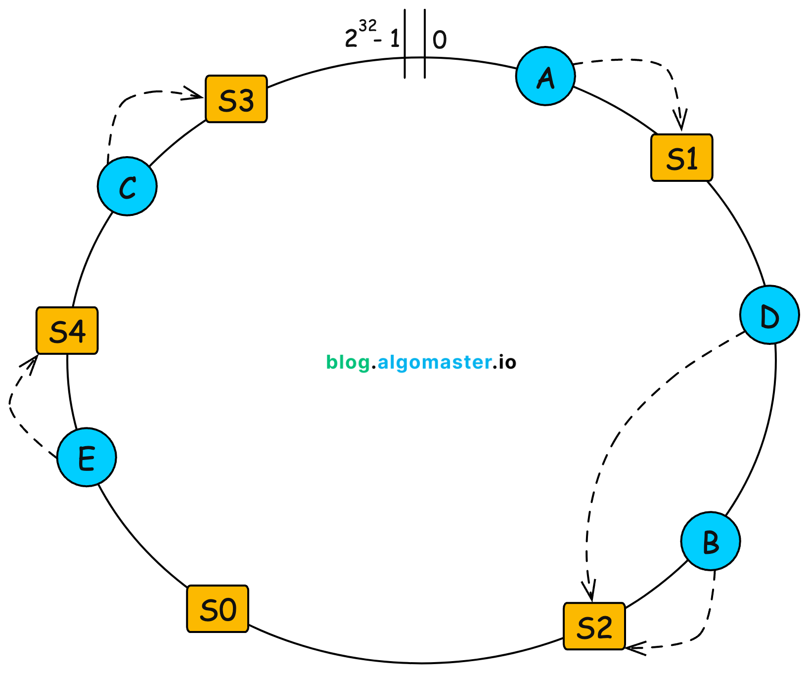
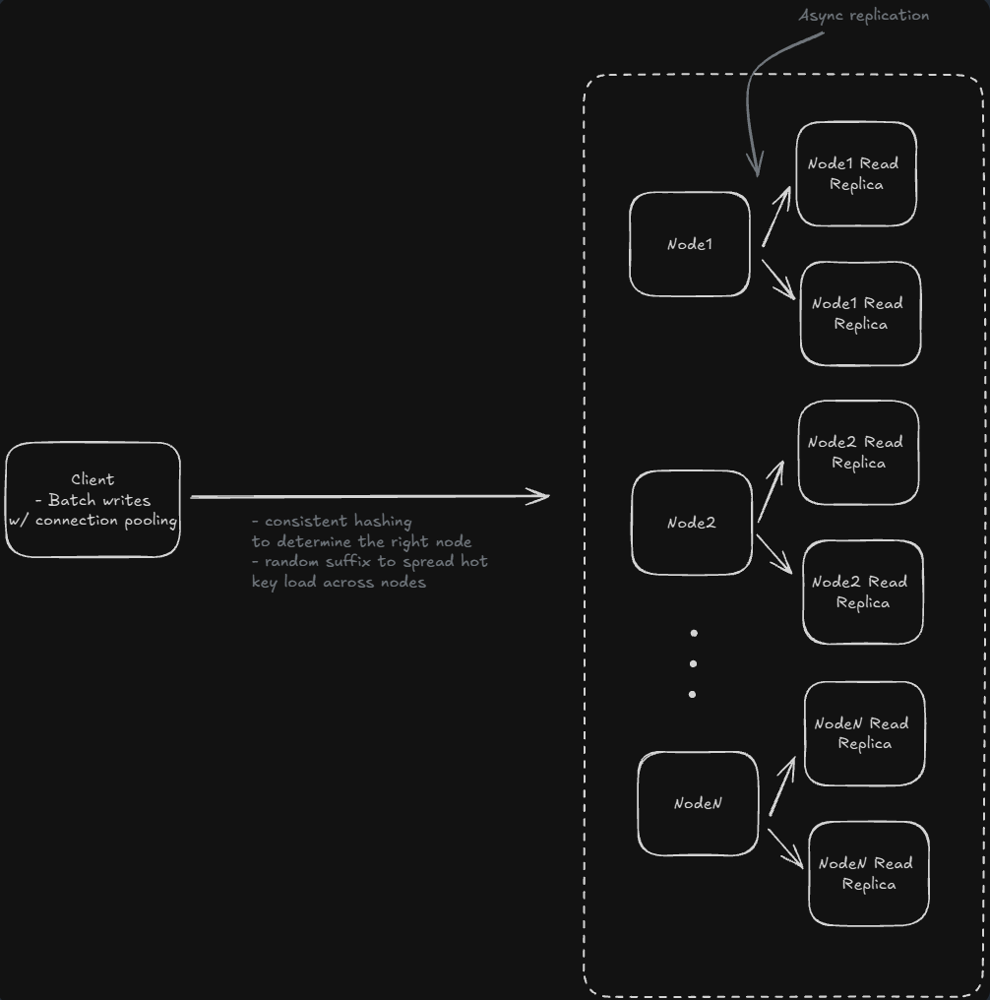

---

# **Distributed Cache (Redis / Memcached)**

---

## **1. Functional Requirements**

* **GET** – fetch value by key with **low latency**
* **PUT** – insert/update key–value
* **DELETE** – remove key
* **TTL Support** – automatic expiry
* **Eviction Policy** – remove entries when memory is full (LRU/LFU)

**Out of scope**: complex queries, joins, full-text search.

---

## **2. Non-Functional Requirements**

* **Latency:** sub-ms to low single-digit ms
* **Scalability:** horizontally scalable
* **CAP:** AP > CP (availability preferred over strict consistency)
* **Consistency:** eventual consistency acceptable
* **Memory Efficiency:** optimized usage + smart eviction
* **High Availability:** replication required

---

## **3. Core Entities**

* **Key**
* **Value**
* **Metadata:**

  * TTL / expiry timestamp
  * Last accessed time (eviction)
  * Object size

---

## **4. API Design**

### **Endpoints**

* **GET** `/cache/{key}`
* **PUT** `/cache/{key}`
* **DELETE** `/cache/{key}`

### **Headers**

* `X-TTL`: time to live (seconds)

**Auth:** via API Gateway.

---

## **5. High-Level Design (HLD)**

### **1. Key Operations**

* Use **Hash Table** for O(1) access.

### **2. TTL / Expiry Handling**

* Store value + expiry timestamp
* Two mechanisms:

  * **Lazy Expiry:** on GET, check TTL and delete if expired
  * **Active Expiry (Janitor Service):** periodic cleanup

### **3. Memory Limits → LRU Eviction**

Use:

* **HashMap** → key → (value, DLL node pointer)
* **Doubly Linked List (DLL)** to track recency

  * Most recently used → front
  * LRU → back (evict this)

### **4. (LLD enough here; HLD handled in deep dives)**

---

# **6. Deep Dives (Critical System Aspects)**

---

## **6.1 High Availability & Fault Tolerance**

### **Replication Strategies**

1. **Async Primary → Replicas**

   * High availability, low latency
   * Eventual consistency

2. **Peer-to-Peer (Gossip + Consistent Hashing)**

   * Every node equal
   * Best for massive horizontal scaling

### **Replication Decisions**

* What to replicate?

  * Writes + invalidations
* Frequency?

  * Async for performance
  * Periodic anti-entropy sync

---

## **6.2 Scalability**

### **Throughput Scaling**

* Requirement: **100k req/s**
* A typical machine: **~20k req/s**
  → Need **~5 nodes** for compute
  → Always overprovision (+30–40%)

### **Storage Scaling**

* Machine: 32GB RAM → ~24GB usable
* Requirement: **1 TB**
  → **1024 / 24 ≈ 43** → ~50 nodes

Start with **10 nodes**, scale out using autoscaling + consistent hashing.

---

## **6.3 Even Key Distribution**

Use **Consistent Hashing**:

* Prevents major reshuffling on node addition/removal
* Smooth key distribution
* Supports virtual nodes for uniformity

---

## **6.4 Hot Key Handling**

### **Hot Reads**

* Bad: vertical scaling
* Good:

  * **Dedicated Hot Key Cache** (on stronger nodes)
  * **Multiple Read Replicas** per hot key

### **Hot Writes**

Techniques:

* **Random Suffixing**

  * Write key as `key_1`, `key_2`, ...
  * Distributes load across multiple machines
  * For reads → pick any replica (eventual convergence)

* **Read Aggregation**

  * On read: fetch from all shards and combine (for counters)

---

## **6.5 Keeping Keys in Sync**

If consistency requirements are relaxed:

* **Background sync tasks**
* **Write batching** for high-frequency writes
* **Per-shard write distribution** (for counters, temporary stats)

Write-heavy hot key strategy:

* Write to any one shard
* Readers merge results from all shards

---

## **6.6 Persistence (optional)**

If durability required:

* **AOF (Append Only File)** or Write batching to persistent store
* **Snapshots**
* **Sync to cold storage** periodically

### **Connection Pooling**

* Maintain persistent TCP connections
* Reduce handshake cost
* Important for high QPS systems

---

# **7. Final Architecture Summary**

### **Data Structures**

* **HashMap** + **Doubly Linked List** (LRU)

### **Distributed System Components**

* **Consistent Hashing** for sharding
* **Async Replication** for HA
* **Hot Key Handling**

  * Random suffixing
  * Hot cache tier
* **Write Batching** for high-write keys
* **Connection Pooling** for performance
* **TTL Engine + Janitor** for expiry

---

## **Optional Add-Ons (Good to Mention)**

* **Bloom filters** for fast "key definitely doesn't exist"
* **Compression** for large values
* **Metrics + Monitoring** (latency, hit ratio, evictions)
* **Circuit breakers & retries** for client SDK
* **Backup and restore workflow**
* **Autoscaling based on CPU + memory + hit ratio**

---

