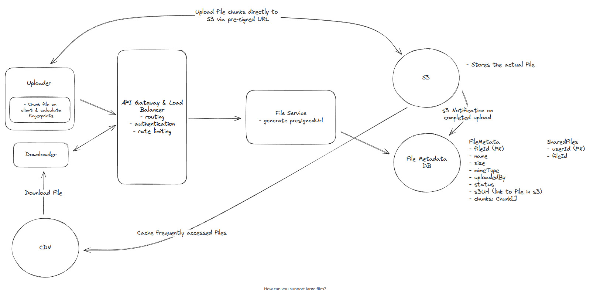

# System Design: Cloud File Storage & Sync (Dropbox/Google Drive)

## 1. Functional Requirements

* **Upload:** Support file uploads from any device.
* **Download:** Support file downloads to any device.
* **Sharing:** Ability to share files with other registered users.
* **Syncing:** Automatically synchronize files across all logged-in devices.
* **Out of Scope:** In-app file editing and viewing files without downloading.

## 2. Non-Functional Requirements

* **Availability:** Highly available over strong consistency (AP over CP in CAP theorem).
* **Scalability:** Must support large files (50GB+).
* **Security:** Secure data transfer and reliable storage.
* **Performance:** High-speed uploads, downloads, and synchronization.

## 3. Data Entities

* **User:** User account information and authentication details.
* **File:** Binary data stored in blob storage.
* **Metadata:** Database records containing file attributes (name, size, type, etc.).

## 4. API Design

* `POST /upload`: Initiates the upload process.
* `GET /download`: Retrieves a file or download link.
* `POST /share`: Grants file access to another user.
* **Authentication:** User data is stored in a **JWT token** or **Session Key** passed exclusively in the request header.

---

## 5. High-Level Design (HLD)

### I. Upload Strategy

* **Bad:** Uploading directly to the application server (bottlenecks).
* **Good:** Client uploads to the backend, which then streams to blob storage.
* **Best:** Client requests a **Pre-signed URL** from the server and uploads the file directly to Blob Storage (e.g., S3).
* **Large Files:** Use the "Best" solution combined with **Chunked Storage** for better handling of massive blobs.

### II. Download Strategy

* **Bad:** Proxying the file from Blob Storage through the backend to the client.
* **Good:** Providing a direct Pre-signed URL for the blob to the client.
* **Best:** Use a **CDN** to cache frequently accessed files at edge locations for ultra-low latency downloads.

### III. Sharing Strategy

* **Bad:** Adding a list of shared users directly into the file's metadata (scales poorly).
* **Good:** Caching a "shared users" list to fetch metadata faster.
* **Best:** Maintain a dedicated `SharedFiles` table mapping `userId` to `fileId`.

### IV. Synchronization (Local vs. Remote)

* **Local → Remote:** A client-side agent monitors local file changes, queues modified files, and handles the upload.
* **Remote → Local:**
* **Polling:** Client periodically asks the server for updates.
* **WebSockets/SSE:** Server maintains an open connection and "pushes" notifications when a change occurs.

* **Hybrid Approach:** Use **WebSockets** for recently edited files (high activity) and **Periodic Polling** for stale files (low frequency).

---

## 6. System Architecture (ASCII)

---

## 7. Deep Dives

### I. Supporting Large Files

* **Challenges:** Network timeouts, browser memory limits, and poor UX on failure.
* **Solution:** **Chunking** & **Multipart Uploads**.
* **Multipart Upload API (S3):** Each chunk is assigned a pre-signed URL and a part number.
* **Verification:** Use server-side ETag verification.
* **Deduplication:** Chunks can be named using a fingerprint (hash) to avoid storing duplicate blocks.

### II. Speed Optimization

* **Parallelism:** Upload/download multiple chunks simultaneously if bandwidth allows.
* **Compression:** Compress files before upload.
* **Ordering:** Always compress *before* encrypting to maximize the reduction in file size.

### III. Security & Reliability

* **In-Transit:** TLS/SSL encryption for all data movement.
* **At-Rest:** Server-side encryption (SSE) in S3.
* **Access Control:** Use Pre-signed URLs with short **Time-to-Live (TTL)** to ensure shared links expire quickly and limit exposure.

---