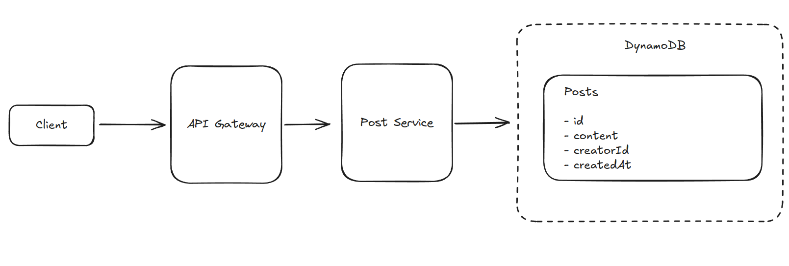
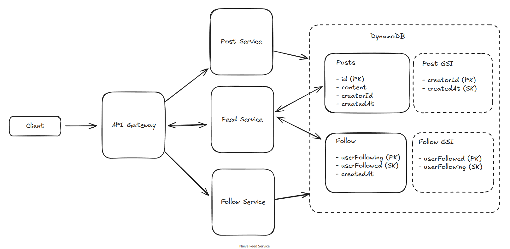
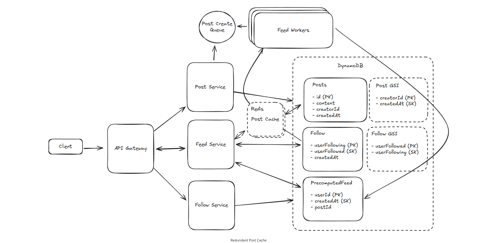

---

# FB News Feed System — High Level Design

## Functional Requirements

1. Create Posts
2. Follow People
3. View Feed
4. Page Through Feed

Out of Scope:

* Likes and comments
* Post types (private/public)

---

## Non-Functional Requirements

* Posts visible in under 1 minute (eventual consistency)
* Posting and viewing latency under 500ms
* Scale to 2B users
* Unlimited follower/following graph

---

## Core Entities

1. User
2. Follow
3. Post

---

## APIs

1. Create Post
   POST /posts

2. Follow People
   PUT /users/[id]/followers

3. View Feed (cursor-based pagination)
   GET /feed?pageSize={size}&cursor={timestamp?}

---

# High-Level Design

## 1. Creating Posts

Posts can be created and stored in a Posts table.

---

## 2. Following / Friending Users

We could use a graph database (Neo4j), but for simplicity we use a key-value model and implement the graph ourselves.

### Follow Table

* userFollowing (Partition Key)
* userFollowed (Sort Key)
* createdAt

This lets us:

* Get all people a user is following (PK query)
* Check if user A follows user B (PK + SK)

### Problem:

How do we quickly get all *followers* of a user?

### Solution: Create GSI

Follow GSI:

* userFollowed (GSI PK)
* userFollowing (GSI SK)

This gives fast reverse lookup.

---

## 3. Viewing Posts From Followed Users

We add a feed service and use a Posts table + Post GSI.

### Posts Table

* id (PK)
* content
* creatorId
* createdAt

Important: In DynamoDB you **cannot query non-key attributes**, so you cannot query creatorId from the base table.

### Post GSI

* creatorId (GSI PK)
* createdAt (GSI SK)

This allows fetching posts of a specific user in chronological order.

This design works for now (naive version).

---

## 4. Pagination Through Feed

Since we have:

* Follow table + GSI
* Posts table + Posts GSI

The naive feed steps:

1. User → Get all followings
2. For each followed user → Get posts via Post GSI
3. Merge posts, sort by createdAt
4. Return paginated feed (cursor = timestamp)

---

# Deep Dives

## 1. Handling Users With Large Number of Follows

If users follow thousands of accounts:

* Fetching posts from all followed users becomes expensive
* Computing the feed on demand becomes slow

### Solution: Precompute Feeds

PrecomputedFeed Table:

* userId (PK)
* createdAt (SK)
* postId

Each userId partition stores the latest ~200 posts.

If user scrolls further → fallback to real-time fetch.

Facebook example: ~2KB/month per user to store feed snapshots, extremely cheap.

---

## 2. Handling Users With Large Number of Followers

Celebrities cause massive fan-out when posting.

### Bad Solution

Write the new post into every follower’s precomputed feed (millions of writes)

### Good Solution

Use async queues/workers to do fan-out in background.

### Best Solution — Hybrid Feed

* Normal users → Precomputed feed
* Celebrities → Skip precompute
* When a user loads feed:

  * Serve precomputed feed
  * Merge posts from celebrity accounts on-demand

This changes huge fan-out writes into lightweight reads.

---

## 3. Handling High Read Traffic on Popular Posts

Popular posts create hotkeys in the Posts table.

### Good Solution

Post Cache:

* Large keyspace
* Long TTL (posts rarely change)
* Reduces DB load

### Best Solution

Redundant Post Cache:

* Multiple identical cache nodes storing the same post data
* Each read chooses any cache node
* Worst case DB gets N reads per window instead of thousands per second

---
