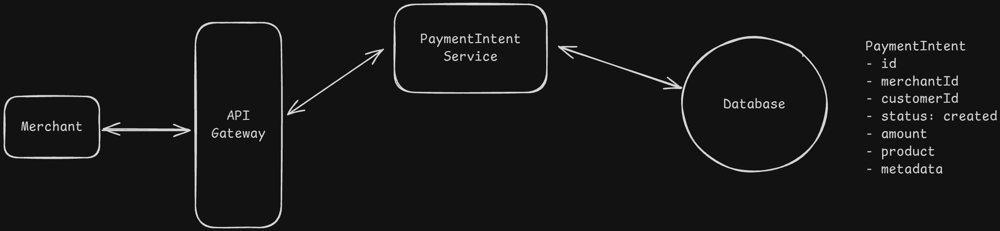
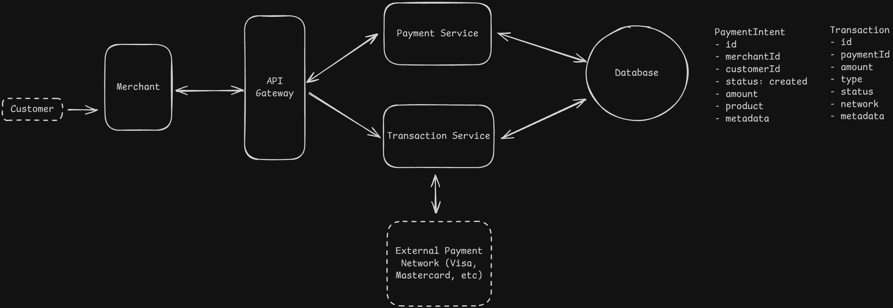
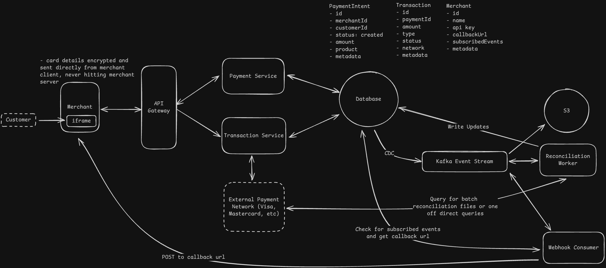

---

# **Payment System (Stripe-like)**

---

## **1. Functional Requirements**

* Merchant can **initiate a payment request**
* Customer can **pay using credit/debit cards, etc.**
* Merchant can **fetch payment status**

**Out of scope:**
saving payment methods, refunds, transaction history, subscriptions, payouts, risk engine.

---

## **2. Non-Functional Requirements**

* **Highly secure** end-to-end
* **Strong durability** — *NO payment loss ever*
* **Auditability** — multi-year retention
* **Transaction integrity** — avoid double charge
* **High throughput** → **10K+ TPS** sustained, bursts during sale
* **Scalable**, elastically

---

## **3. Core Entities**

### **Merchant**

* Registered seller

### **PaymentIntent**

* Represents merchant’s request to collect money
* Contains: amount, currency, merchantId, status
* **1 Intent → Many Transactions**

### **Transaction**

* Actual money movement record
* Each attempt of authorization/capture/settlement

**Relationships:**
**PaymentIntent (1) → (n) Transactions**

---

## **4. API Design**

### **Endpoints**

* `POST /paymentIntent` → returns `paymentIntentId`
* `POST /paymentIntent/{id}/transaction`
* `GET /paymentIntent/{id}/status`

**Auth:** API keys (recommended: signed requests)

---

# **5. High Level Design (HLD)**

---

## **1. Merchant initiates payment**

Component: **Payment Intent Service**

* Creates and stores PaymentIntent
* Generates client-secret for frontend

---

## **2. Customer completes payment**

Use a **multi-step card flow**:

1. **Authorization**
2. **Capture**
3. **Settlement**

Component: **Transaction Service**

* Handles each attempt as a separate Transaction
* Talks to card networks / processors

---

## **3. Status Tracking**

* **PaymentIntent Service** queries DB
* Aggregates transactions → returns final status

---

# **6. Deep Dives (Critical System Aspects)**

---

## **6.1 Security (Top Priority)**

### **Do NOT store card info on merchant’s backend**

* Merchants must *never* see PAN/Card numbers
* Prevent PCI scope explosion

### **Safe approach: Client-side isolation**

* Provide **JS SDK**
* Load an **iframe** hosted by payment provider
* User enters card details → iframe posts encrypted data
* Merchant’s server only receives a *token*

### **Request signing**

* Merchant signs each request with HMAC
* Server verifies signature to avoid tampering

---

## **6.2 Durability + Auditability**

**Goal: Never lose a transaction, ever.**

### **Data Model**

* **Transactions Table**
* **Audit Logs Table** (immutable)

### **How to guarantee audit writes?**

* **Do NOT rely on application code** (humans forget)
* Use **Change Data Capture (CDC)**:

DB → CDC → Kafka →

* Audit Service
* Webhook Service
* Analytics
* Fraud engine

### **Data retention**

* Keep recent data in DB for fast access
* Offload older logs → **S3** (cheap storage)

### **Avoid CDC as SPOF**

* Multiple CDC nodes
* App falls back to writing directly to Kafka stream

---

## **6.3 Transaction Safety (Async + Banking Delays)**

### **Issue: double charging if timeouts occur**

Bad solution: treat timeout = failure → retry blindly → duplicate charges.
Good solution: timeout → **Pending** → manual reconciliation.
Great solution: **Event-driven safety**.

### **Two-phase transaction model**

1. **TransactionCreated event**
2. **TransactionCompleted event**

### **Automated Reconciliation Service**

* Handles bank delays
* Periodically checks pending transactions
* Ensures correctness even in partial failure

---

## **6.4 Scalability (10K TPS + Holiday Bursts)**

### **Streaming (Kafka)**

* Kafka → millions/sec
* Per partition → ~5k–10k TPS
  → Use **3–5 partitions** per high-traffic topic
* Use **PaymentIntentId** as partition key → ordering preserved
* Replication factor = **3** for fault tolerance

### **Database Scaling**

Assume:

* Row ~500 bytes
* 10k tps
  → **5 MB/sec**
  → **~500GB/day**
  → **~180TB/year**

**Strategy:**

* Keep 3–6 months in primary DB
* Cold archive to **S3**
* Partition DB by merchant / region
* Use read replicas

---

# **Bonus Deep Dive: Webhook Framework**

### **Merchant provides:**

1. Target URL
2. Subscribed events (payment_succeeded, payment_failed, etc.)

### **Flow**

DB change →
CDC →
Kafka →
Webhook Delivery Service →

* Retries
* Signature verification
* Backoff
  → Merchant endpoint

---

# **7. Final Architecture Summary**

* **Payment Intent Service**
* **Transaction Service**
* **Card Iframe SDK** for secure card input
* **Change Data Capture** for audit reliability
* **Kafka** for event-driven architecture
* **Reconciliation Service** for safety
* **Webhook Service** for merchant callbacks
* **DB + S3** storage lifecycle
* **Signed API Requests**, API Keys
* **Scalable, burst-ready infrastructure**

---