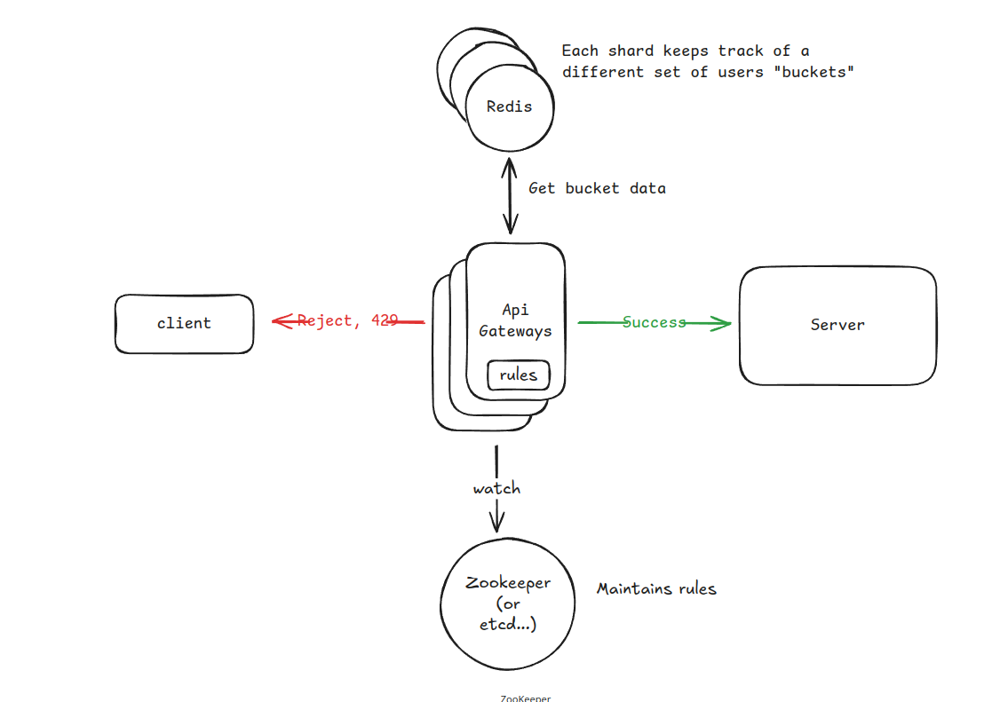

---

# System Design: Scalable Rate Limiter

A distributed rate limiter to control the rate of traffic sent by a client or a service. It limits the number of requests allowed within a specific time frame to prevent resource starvation and DoS attacks.

## 1. Requirements

### Functional Requirements

* **Identity:** Identify clients via `user_id`, `IP address`, or `API_Key`.
* **Flexibility:** Support configurable rules (e.g., 1000 requests/min).
* **Feedback:** Return clear HTTP status codes (429) and usage headers.

### Non-Functional Requirements

* **Low Latency:** Rate limiting check must be ultra-fast (< 10ms).
* **Scalability:** Support 1M requests per second (RPS) across 100M Daily Active Users (DAU).
* **High Availability:** The system must remain available even if a limiting node fails.
* **Consistency:** Eventual consistency is acceptable; strict global accuracy is traded for lower latency.

### Out of Scope

* Deep analytics/OLAP on rate limiting data.
* Long-term persistence (historical data) of every request.

---

## 2. Core Entities & Interface

### Entities

* **Rule:** Defines the threshold (e.g., 5 requests per second).
* **Client:** The entity being limited (User, IP, or App).
* **Bucket/Counter:** The stateful data representing current usage.

### System Interface

```typescript
isRequestAllowed(clientId: string, ruleId: string) => { 
    passes: boolean, 
    remaining: number, 
    resetTime: number 
}

```

---

## 3. High-Level Design (HLD)

### Placement

We place the rate limiter at the **API Gateway/Sidecar** level. This prevents unauthorized traffic from ever reaching the application servers, saving compute resources.

### Algorithms Comparison

| Algorithm | Pros | Cons |
| --- | --- | --- |
| **Fixed Window** | Memory efficient | Spikes at window edges can allow 2x traffic |
| **Sliding Window Log** | Very accurate | High memory footprint (stores all timestamps) |
| **Sliding Window Counter** | Smooths out spikes | Approximation (not 100% accurate) |
| **Token Bucket** | **Recommended.** Handles bursts, memory efficient | Requires state (tokens + timestamp) |

### Storage & Atomicity (The Redis Strategy)

To handle 1M RPS, we use **Redis** due to its in-memory speed and support for TTL (Time-To-Live) which automatically handles data cleanup.

#### Handling Race Conditions

When two requests from the same user hit different gateway nodes simultaneously, a "read-modify-write" cycle can cause lost updates. We solve this using **Lua Scripts**. Redis executes Lua scripts atomically.

**Logic for Token Bucket in Lua:**

```lua
local current_tokens = redis.call("get", KEYS[1])
if not current_tokens then
    current_tokens = ARGV[1] -- Initial capacity
end
-- Calculate refill based on time elapsed since last_refill_time
-- Update tokens and return result

```

---

## 4. Deep Dives & Scaling

### 1. Scaling to 1M RPS

A single Redis node can handle ~100k-150k RPS. For 1M RPS, we need a **Redis Cluster**.

* **Sharding:** Data is partitioned across nodes using Hash Slots.
* **Key Design:** We use `client_id` as the shard key to ensure all requests for a specific user land on the same shard, maintaining local atomicity.

### 2. High Availability & Fault Tolerance

* **Replication:** Use Master-Replica setup. If a Master fails, a Replica is promoted.
* **Fail Strategy:**
* **Fail Open:** If the Rate Limiter service is down, let traffic pass. Better to risk overload than a total outage.
* **Fail Closed:** Stop all traffic. Used for high-security or expensive billing APIs.


### 3. Minimizing Latency

* **Connection Pooling:** Use persistent TCP connections to avoid the overhead of the 3-way handshake on every request.
* **Edge Limiting:** Deploy rate limiters at the CDN level (Edge locations) to reject "bad" traffic closer to the user.

### 4. Handling "Hot Keys"

Viral content or aggressive bots can overwhelm a single Redis shard.

* **Global vs. Local:** Perform "soft" limiting locally at the Gateway (in-memory) and "hard" limiting globally in Redis.
* **IP-Based Caution:** Be careful with IP limits; large offices or universities share one public IP. Use `user_id` where possible.

### 5. Dynamic Rule Configuration

* **Polling:** Gateways check a central DB/S3 bucket every 1 minute. Simple, but slow updates.
* **Push (Zookeeper/Etcd):** Use a distributed configuration service. When a dev updates a rule, Zookeeper pushes the change to all Gateway nodes instantly.

---

## 5. Response Headers

When a request is processed, the system returns:

* `HTTP 429 Too Many Requests` (if throttled)
* `X-Ratelimit-Limit`: Max requests allowed in the window.
* `X-Ratelimit-Remaining`: Remaining requests in current window.
* `X-Ratelimit-Reset`: Unix timestamp when the bucket refills.

---




