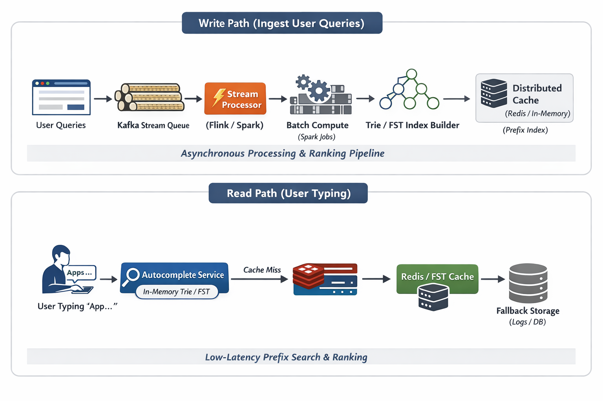
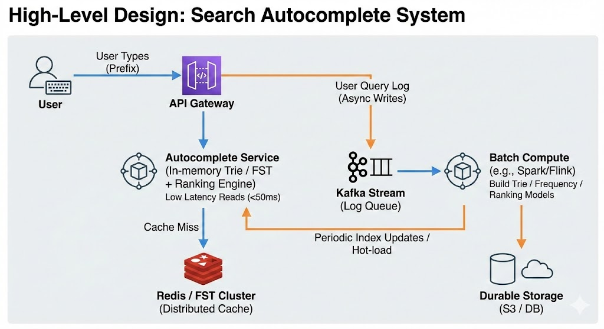

---

# **System Design: Search Autocomplete**

---

## **1. Functional Requirements**

* **Real-time Suggestions:** Return top *k* ranked suggestions within **<50ms** as user types.
* **Prefix-based Search:** Query by prefix, not full text.
* **Personalized Suggestions:** (Optional) Based on user history.
* **Trending Queries:** Include popular or global trending terms.

**Out of Scope:**

* Full-text search, semantic search, vector search
* Spell correction
* Ads ranking

---

## **2. Non-Functional Requirements**

* **Latency:** p99 < **50ms**
* **Scalability:** 100M DAU, peak **200K QPS** reads, **5K QPS writes**
* **Availability:** 99.99%
* **Consistency:** Eventual consistency (read-heavy system)
* **Security/Durability:** Encrypted network communication (TLS), durable write store

---

## **3. Core Entities**

| Entity         | Purpose                                      |
| -------------- | -------------------------------------------- |
| **Query**      | Search string entered by users               |
| **Suggestion** | Autocomplete candidate generated from prefix |
| **Metadata**   | Popularity score, frequency, recency         |

**Relationships:**
*Query 1:N Suggestions*
*Suggestion N:1 Metadata*

---

## **4. API Design**

### **Endpoints**

* `GET /autocomplete?q=<prefix>&userId=<id>`
  — Returns top ranked suggestions for a prefix.

* `POST /queries`
  — Ingest search queries for training/ranking.

* `POST /admin/reindex`
  — Trigger rebuild/maintenance (internal).

**Auth:**
*User APIs:* API key / OAuth
*Admin APIs:* JWT + internal VPN

---

## **5. High-Level Design (HLD)**

### **5.1 Write Path (Ingest User Queries)**

**Bad:**
Insert incoming queries directly into DB → heavy write load, slow, no batching.

**Good:**
Write queries to a Log Queue (Kafka/PubSub) → async processing.

**Best:**
Kafka → Stream Processor → Batch Compute (Spark/Flink) → Build Trie/Prefix Index → Push to distributed in-memory cache
*Why:* decouples ingestion & ranking, supports trending updates, scalability.

---

### **5.2 Read Path (User Typing)**

**Bad:**
Query DB on each keystroke → too slow.

**Good:**
Use Redis/Memcached with prefix keys → better but memory heavy.

**Best:**
Pre-built compressed Trie / FST (Finite State Transducer) in distributed in-memory cluster (Redis cluster / custom service) → <5ms lookups.
Ranking applied in-memory using scores.

---

### **5.3 Ranking Engine (Popularity + Personalization)**

* Global frequency score (TF)
* Recency decay
* Personalized history-based reranking
* Trending boost (from real-time streams)

Ranking runs in batch + real-time incrementals.

---

## **6. System Architecture (ASCII Diagram)**

---

## **7. Deep Dives**

### **7.1 Hot Keys / Prefix Skew**

**Problem:**
Some prefixes (e.g., “a”, “the”) are extremely hot → cause load imbalance.

**Solution:**

* Shard Trie by prefix hash
* Cache top-level prefixes separately
* Add request-level load balancing

**Trade-offs:**
More memory usage but prevents hot-spotting.

---

### **7.2 Replication & Fault Tolerance**

**Problem:**
Node failures must not degrade read performance.

**Solution:**

* Multi-region Redis/Trie replicas
* Leader-follower replication for compute jobs
* Active-active read nodes

**Trade-offs:**
Increased cost, cross-region latency needs careful design.

---

### **7.3 Durability & Index Rebuilds**

**Problem:**
Index corruption or stale Trie can cripple reads.

**Solution:**

* Store raw data in durable storage (S3/HDFS)
* Rebuild Trie periodically
* Use versioned Trie & blue-green index deployment

**Trade-offs:**
Higher storage & compute cost, but ensures safe rollback.

---

## **8. Capacity Estimation**

| Metric                 | Value                 |
| ---------------------- | --------------------- |
| Avg query length       | 20 bytes              |
| Stored suggestions     | 500M                  |
| Storage per suggestion | ~100 bytes            |
| Total stored           | ~50GB                 |
| Read TPS               | 200K QPS              |
| Write TPS              | 5K QPS                |
| Nodes needed           | 10–20 in-memory nodes |

---

## **9. Final Architecture Summary**

* **Kafka pipeline** for ingestion
* **Spark/Flink** for building ranked Trie
* **Distributed in-memory Trie / FST** for ultra-low-latency reads
* **Redis cluster** fallback
* **API Gateway + Autoscaled Autocomplete Svc**
* **Blue/Green Trie rebuild + rollout**
* Designed for read-heavy workloads with eventual consistency

---

## **10. Bonus (Advanced Concepts)**

* **Bloom filters** to quickly check prefix existence
* **Circuit breakers + retries** in API layer
* **Webhooks/CDCs** to inform ranking system of sudden spikes
* **A/B ranking experiments**

---

