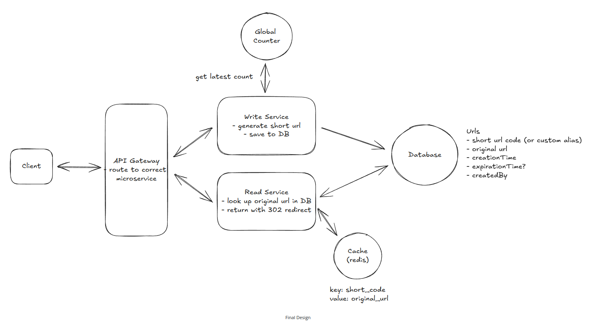

# URL Shortener – High Level Design (HLD)

## 1. Functional Requirements

- User provides a long URL and receives a short URL
- User can:
  - Provide a custom alias
  - Set a TTL (expiration time)
- User can access the original URL using the short URL
- Read-heavy system
  - Reads are ~100x more frequent than writes

---

## 2. Non-Functional Requirements

- Uniqueness of short URLs
- Minimal redirect latency
- High availability (99.99%)
- Scalability
  - Up to 1B shortened URLs
  - 100M DAU

---

## 3. Core Entities

### URL
- Original URL
- Short URL / Alias
- Creation Time
- Expiration Time
- Created By

### User
- User ID
- Authentication metadata (optional for MVP)

---

## 4. APIs

### POST /urls

**Description:** Create a shortened URL  
**Request Body:**
```json
{
  "longUrl": "https://example.com",
  "customAlias": "my-link",
  "ttl": 86400
}
````

---

### GET /{shortcode}

**Description:** Redirect to the original URL

---

## 5. Redirect Types

* **301 – Permanent Redirect**

  * Cached by browsers and CDNs
* **302 – Temporary Redirect**

  * Preferred when TTL is used

---

## 6. High-Level Architecture

```
Client
   |
API Gateway
   |
---------------------
|                   |
Write Service    Read Service
|                   |
Redis Counter    Redis Cache
|                   |
Database (URLs Table)
```

---

## 7. Database Schema

### urls Table

| Column Name     | Type      |
| --------------- | --------- |
| shortcode       | VARCHAR   |
| original_url    | TEXT      |
| creation_time   | TIMESTAMP |
| expiration_time | TIMESTAMP |
| created_by      | VARCHAR   |

---

## 8. Ensuring Short URL Uniqueness

### ❌ Bad Approach

* Prefixing URLs manually

### ✅ Good Approaches

#### Option 1: Hashing

* Hash the long URL
* Risk of collisions → needs collision handling

#### Option 2 (Preferred): Base62 + Counter

* Use a global incremental counter
* Encode counter value using Base62
* Guarantees uniqueness

---

## 9. Handling Counter at Scale

### Problem

* Horizontal scaling causes counter synchronization issues

### Solution

* Use a centralized Redis instance to store the counter

### Optimization: Counter Batching

* Each service fetches a batch of 1000 counters
* Reduces Redis network calls
* Improves write throughput

---

## 10. Ensuring Fast Redirects

### ❌ Basic Solution

* DB index on shortcode

### ✅ Optimized Solution

* Redis Cache

  * Key: shortcode
  * Value: original_url
* CDN

  * Cache hot redirects at edge locations

**Read Flow:**

```
Client → CDN → Read Service → Redis Cache → DB (fallback)
```

---

## 11. Scaling to 1B URLs & 100M DAU

### Storage Estimation (Per Row)

| Field           | Size   |
| --------------- | ------ |
| Shortcode       | 8 B    |
| Original URL    | 100 B  |
| Creation Time   | 8 B    |
| Expiration Time | 8 B    |
| Metadata        | ~376 B |

**Total per row:** ~500 bytes

### Total Storage

```
1B URLs × 500 bytes ≈ 500 GB
```

* Easily supported by modern SSD-backed databases
* Can scale further via horizontal sharding

---

## 12. Write Throughput

* ~100K URLs created per day
* ≈ 1 write/sec
* Easily handled by standard relational or NoSQL DBs

---

## 13. High Availability Strategy

### Database

* Primary + Read Replicas
* Automated backups
* Failover support

### Redis

* Redis Cluster with:

  * Automatic failover
  * Cross-region replication

### Services

* Stateless services
* Horizontal auto-scaling

---

## 14. Read-Write Separation

### Write Service

* URL creation
* Counter allocation

### Read Service

* Redirect handling
* Cache-first strategy

This allows:

* Independent scaling
* Better fault isolation

---

## 15. Final Design Summary


